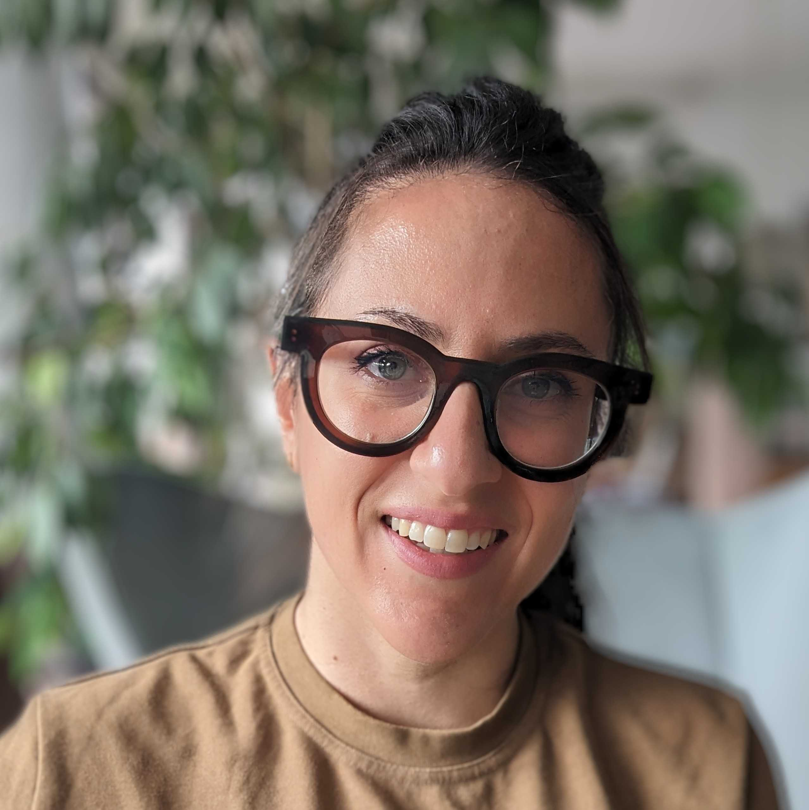

# Soapbox Science Tübingen

## Our mission

Soapbox Science is a novel public outreach platform for promoting women and
non-binary scientists and the science they do. Events transform public areas
into an arena for public learning and scientific debate; they follow the format
of London Hyde Park’s Speaker’s Corner, which is historically an arena for
public debate. With Soapbox Science, we want to make sure that everyone has the
opportunity to enjoy, learn from, heckle, question, probe, interact with and be
inspired by some of our leading scientists. No middle man, no PowerPoint slide,
no amphitheatre – just remarkable women and non-binary scientists who are there
to amaze you with their latest discoveries, and to answer the science questions
you have been burning to ask. Or simply hear them talk about what
fascinates them, and why they think they have the most fantastic job in the
world!

26 July 2025
{: style="color:#159957; font-size: 200%; font-weight: bold; text-align: center;"}
Tübingen town centre
{: style="color:#159957; font-size: 150%; font-weight: bold; text-align: center;"}

## Speakers

 

  

   
    Alexandra Waldherr
    

      I am a PhD student in Andrei Lupas' group at the Max Planck Institute for
      Biology, studying protein design with a combination of computer and
      laboratory methods. My focus lies on non-canonical amino acids, and I am
      interested in the chemistry of unconventional side chains.
    

  

  

   
    Ana Villar
    

      I am a third-year PhD student in Cancer Biology. Originally from Spain, I did my
      Master in Tübingen. Now, almost at the end of the PhD I´m looking forward to
      moving in the neuropsychology field as I fell in love with our minds and their
      great power on us. At this years’ Tübingen Soapbox Science, I will give a quick
      view about skin cancer, what is known, what is still not known, interesting
      facts… Enthusiastic, passionate and empathetic; that is me!
    

  

  

   
    Annalena Kofler
    

      I am a PhD student at the Max Planck Institute for Intelligent Systems
      where I develop machine learning methods to analyze
      gravitational wave signals resulting from the collision of black
      holes. 
    

  

  

   
    Dr-Ing Dipl-Ing (FH) Bianca Weber-Lewerenz
    

     Self-employed civil engineer and freelance scientific researcher on the
     responsible entrepreneurial handling of digitalisation and AI in
     the construction industry. I received my PhD at the RWTH Aachen
     University in 2024 and am the Founder of the ‘Excellence
     Initiative for Sustainable, Human-led AI in Construction’. 
    

  

   

  

  

   
    Carolina Guidolin
    

      I am a PhD student in circadian neuroscience, and I am interested in the
      effect of light on our "body clock". I am looking forward to present my
      research on the effect of sex hormones on melatonin suppression in the evening!
    

  

  

   
    Dr Christina Preiser
    

      I am a sociologist who does research in occupational medicine on the
      prevention of work-related cancers in agriculture and
      construction and at this years’ Tübingen Soapbox Science event I
      will talk about the prevention of skin cancer.
    

  

    

   
    Elise Bücklein
    

      I am currently a PhD candidate at the Faculty of Medicine
      (Psychiatry) at the University of Tübingen and part of the
      IRTG2804, a research training group with the goal of
      understanding women’s mental health across the reproductive
      years. While my field of expertise is premenstrual dysphoric
      disorder (a severe form of PMS) and depression in women, I am
      passionate about researching women’s (mental) health in general
      because it has been overlooked for so long in science, and there
      is still so much we don’t know! The potential to improve the
      lives of millions of women through further research in this
      field is truly endless.
    

  

    

   
    Gesa Freimann
    

      I am a first-year PhD student at the Max Planck Institute for
      Biology in Tübingen. My research focuses on exploring the
      dynamic behavior of proteins involved in signal transduction
      using computational methods. In my free time, I like to relax
      with a good board game or find my zen through yoga.
    

  

  

 

  

  
    Hanna Wierenga
    

      I am doing an interdisciplinary PhD at Psychiatry researching
      the linkage between gender and mental health and a specific
      focus on mental health during and after a pregnancy. I will
      present my research on gender identity across Europe and the
      linkage to mental health. I am excited to share this relatively
      niche, yet fascinating scientific field with the general public
      at this years’ Tübingen Soapbox Science. It is my hope to
      eventually inspire young female scholars to achieve their
      scholastic dreams.
    

  

  

    Dr Aleya Marzuki
    

    

  

  

 
    Dr Maydel Fernandez-Alonso
    

      I'm a postdoctoral researcher at the Max Planck Institute for Biological
      Cybernetics investigating how light is processed in the visual
      system to synchronize our internal biological clock with the day
      and night cycle.
    

  

  

   
    Sisi Deng
    

      A gynecologist pursuing a PhD at the iFIT Cluster, Faculty of
      Medicine, University Hospital of Tübingen, I specialize in
      endometriosis and ovarian cancer research. Through the BMBF
      ENDO-RELIEF project, I explore disease mechanisms using MALDI
      imaging, mass spectrometry, and NMR-based metabolomics. At this
      years’ Tübingen Soapbox Science, I would like to share our
      latest findings and further raise awareness of endometriosis and
      my research.
    

  

 

## Organising team

 

  

   
   Ben Höltgen
  

  

   
   Dilsad Er
  

  

   
   Melanie Stelly
  

  

   
   Michela Petriconi
  

 

 

 
  Dr Monika Lam
 

  

  
  Ritu Roy Chowdhury
 

 

  
  Salma Thalji
 

  

  
  Susan Fischer
 

## Speaker call - now closed

We are looking for active researchers from STEMM fields (Science, Technology,
Engineering, Mathematics, and Medicine), including PhD students, postdocs,
professors, and beyond, who:

- Are excited about communicating science in an accessible and engaging way.
- Are passionate about connecting with a diverse audience.
- Identify as a woman or non-binary person.

**When**: 26 July 2025

**Where**: Tübingen town centre

{:style="display:block; margin-left:auto; margin-right:auto"}

## Contact

[soapboxscience.tuebingen@gmail.com](mailto:soapboxscience.tuebingen@gmail.com)

 
 
 

