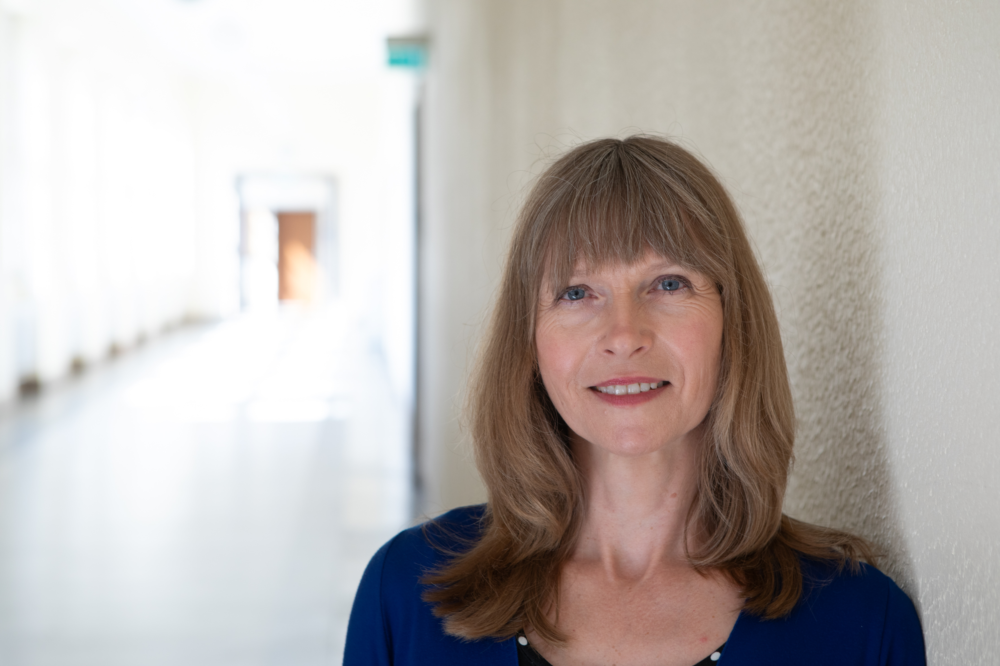
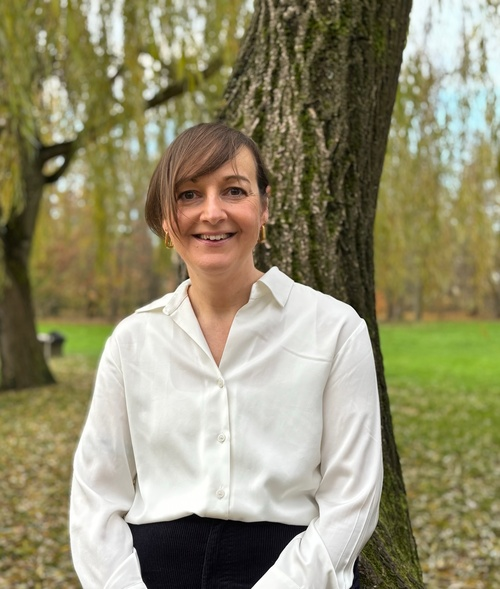

# Soapbox Science Tübingen

## Our mission

Soapbox Science is a novel public outreach platform for promoting women and
non-binary scientists and the science they do. Events transform public areas
into an arena for public learning and scientific debate; they follow the format
of London Hyde Park’s Speaker’s Corner, which is historically an arena for
public debate. With Soapbox Science, we want to make sure that everyone has the
opportunity to enjoy, learn from, heckle, question, probe, interact with and be
inspired by some of our leading scientists. No middle man, no PowerPoint slide,
no amphitheatre – just remarkable women and non-binary scientists who are there
to amaze you with their latest discoveries, and to answer the science questions
you have been burning to ask. Or simply hear them talk about what
fascinates them, and why they think they have the most fantastic job in the
world!

26 July 2025
{: style="color:#159957; font-size: 200%; font-weight: bold; text-align: center;"}

## Speaker call - now closed

We are looking for active researchers from STEMM fields (Science, Technology,
Engineering, Mathematics, and Medicine), including PhD students, postdocs,
professors, and beyond, who:

- Are excited about communicating science in an accessible and engaging way.
- Are passionate about connecting with a diverse audience.
- Identify as a woman or non-binary person.

**When**: 26 July 2025

**Where**: Tübingen town centre

{:style="display:block; margin-left:auto; margin-right:auto"}

## Speakers (coming soon)

## Organising team

 

  
  Ben Höltgen
 

 

  
  Dilsad Er
 

 

  
  Melanie Stelly
 

 

  
  Michela Petriconi
 

 

  Monika Lam
 

  

  
  Ritu Roy Chowdhury
 

  

  
  Susan Fischer
 

## Contact

[soapboxscience.tuebingen@gmail.com](mailto:soapboxscience.tuebingen@gmail.com)

 
 
 

