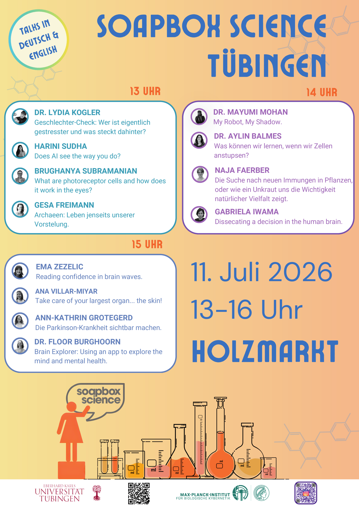
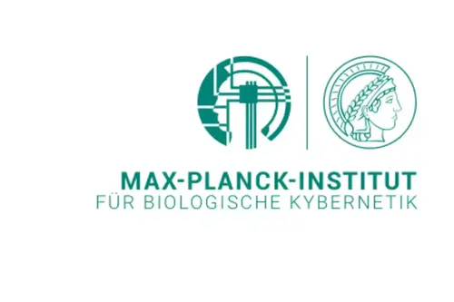
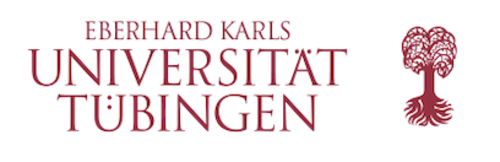
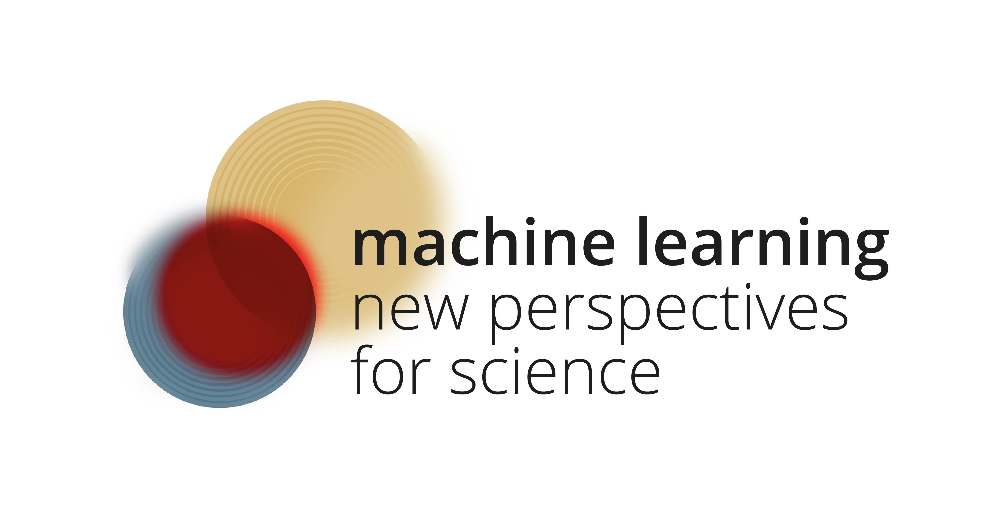
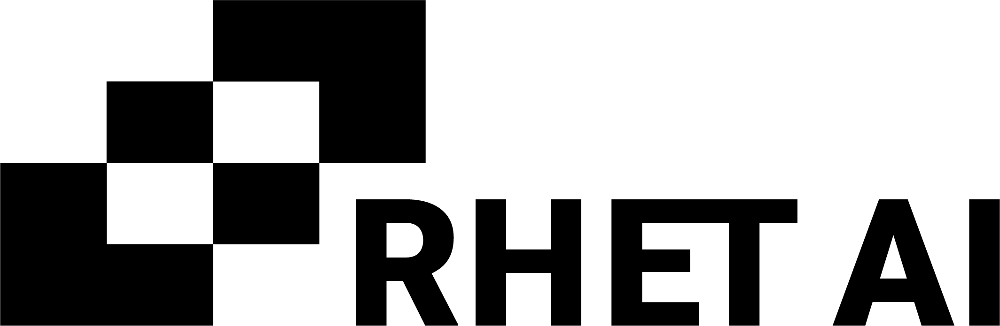

## Our mission

Soapbox Science is a novel public outreach platform for promoting women and
non-binary scientists and the science they do. Events transform public areas
into an arena for public learning and scientific debate; they follow the format
of London Hyde Park’s Speaker’s Corner, which is historically an arena for
public debate. With Soapbox Science, we want to make sure that everyone has the
opportunity to enjoy, learn from, heckle, question, probe, interact with and be
inspired by some of our leading scientists. No middle man, no PowerPoint slide,
no amphitheatre – just remarkable women and non-binary scientists who are there
to amaze you with their latest discoveries, and to answer the science questions
you have been burning to ask. Or simply hear them talk about what
fascinates them, and why they think they have the most fantastic job in the
world!

11 July 2026
{: style="color:#159957; font-size: 200%; font-weight: bold; text-align: center;"}
Tübingen Holzmarkt
{: style="color:#159957; font-size: 150%; font-weight: bold; text-align: center;"}

Curious about our event? [Sign up to volunteer](https://forms.gle/wCfucpFjNLd5hV1a7) — we'd love to have you!
{: style="font-size: 90%; color: #666; text-align: center; background-color: rgba(21, 153, 87, 0.05); padding: 6px 18px; border-radius: 6px; display: table; margin: 0 auto;"}

## Speakers

  
    

      
      {{ speaker.name }}
    

  

## Organising team

  
    

      
      {{ member.name }}
    

  

## Previous years

### [July 2025]({{ site.baseurl }})

## Contact

  

    
    <a href="mailto:soapboxscience.tuebingen@gmail.com">soapboxscience.tuebingen@gmail.com</a>
  

  

    
    <a href="https://www.instagram.com/soapboxscience_tuebingen/?hl=en">Instagram</a>
  

## Partners & Sponsors

 
 
 

 

 
 
 

