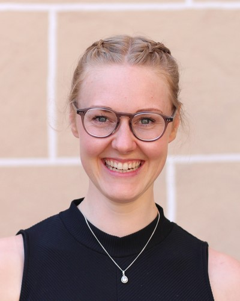

# Soapbox Science Tübingen

## Our mission

Soapbox Science is a novel public outreach platform for promoting women and
non-binary scientists and the science they do. Events transform public areas
into an arena for public learning and scientific debate; they follow the format
of London Hyde Park’s Speaker’s Corner, which is historically an arena for
public debate. With Soapbox Science, we want to make sure that everyone has the
opportunity to enjoy, learn from, heckle, question, probe, interact with and be
inspired by some of our leading scientists. No middle man, no PowerPoint slide,
no amphitheatre – just remarkable women and non-binary scientists who are there
to amaze you with their latest discoveries, and to answer the science questions
you have been burning to ask. Or simply hear them talk about what
fascinates them, and why they think they have the most fantastic job in the
world!

26 July 2025
{: style="color:#159957; font-size: 200%; font-weight: bold; text-align: center;"}
Tübingen town centre
{: style="color:#159957; font-size: 150%; font-weight: bold; text-align: center;"}

## Speakers

 

  

   
    Alexandra Waldherr
    

      I am a PhD student in Andrei Lupas' group at the Max Planck Institute for
      Biology, studying protein design with a combination of computer and
      laboratory methods. My focus lies on non-canonical amino acids, and I am
      interested in the chemistry of unconventional side chains.
    

  

  

   
    Ana Villar
    

      I am a third-year PhD student in Cancer Biology. Originally from Spain, I did my
      Master in Tübingen. Now, almost at the end of the PhD I´m looking forward to
      moving in the neuropsychology field as I fell in love with our minds and their
      great power on us. At this years’ Tübingen Soapbox Science, I will give a quick
      view about skin cancer, what is known, what is still not known, interesting
      facts… Enthusiastic, passionate and empathetic; that is me!
    

  

  

   
    Annalena Kofler
    

      I am a PhD student at the Max Planck Institute for Intelligent Systems where I develop machine learning methods to analyze gravitational wave signals resulting from the collision of black holes. 
    

  

  

   
    Dr-Ing Dipl-Ing (FH) Bianca Weber-Lewerenz
    

      I am a PhD student at the Max Planck Institute for Intelligent Systems where I develop machine learning methods to analyze gravitational wave signals resulting from the collision of black holes. 
    

  

   

  

  

   
    Carolina Guidolin
    

      I am a PhD student at the Max Planck Institute for Intelligent Systems where I develop machine learning methods to analyze gravitational wave signals resulting from the collision of black holes. 
    

  

  

   
    Dr Christina Preiser
    

      I am a PhD student at the Max Planck Institute for Intelligent Systems where I develop machine learning methods to analyze gravitational wave signals resulting from the collision of black holes. 
    

  

    

   
    Elise Bücklein
    

      I am a PhD student at the Max Planck Institute for Intelligent Systems where I develop machine learning methods to analyze gravitational wave signals resulting from the collision of black holes. 
    

  

    

   
    Gesa Freimann
    

      I am a PhD student at the Max Planck Institute for Intelligent Systems where I develop machine learning methods to analyze gravitational wave signals resulting from the collision of black holes. 
    

  

  

 

  

  
    Hanna Wierenga
    

      I am a PhD student at the Max Planck Institute for Intelligent Systems where I develop machine learning methods to analyze gravitational wave signals resulting from the collision of black holes. 
    

  

  

    Dr Aleya Marzuki
    

      I am a PhD student at the Max Planck Institute for Intelligent Systems where I develop machine learning methods to analyze gravitational wave signals resulting from the collision of black holes. 
    

  

  

 
    Dr Maydel Fernandez-Alonso
    

      I am a PhD student at the Max Planck Institute for Intelligent Systems where I develop machine learning methods to analyze gravitational wave signals resulting from the collision of black holes. 
    

  

  

   
    Sisi Deng
    

      I am a PhD student at the Max Planck Institute for Intelligent Systems where I develop machine learning methods to analyze gravitational wave signals resulting from the collision of black holes. 
    

  

 

## Organising team

 

  

   
   Ben Höltgen
  

  

   
   Dilsad Er
  

  

   
   Melanie Stelly
  

  

   
   Michela Petriconi
  

 

 

 
  Dr Monika Lam
 

  

  
  Ritu Roy Chowdhury
 

 

  
  Salma Thalji
 

  

  
  Susan Fischer
 

## Speaker call - now closed

We are looking for active researchers from STEMM fields (Science, Technology,
Engineering, Mathematics, and Medicine), including PhD students, postdocs,
professors, and beyond, who:

- Are excited about communicating science in an accessible and engaging way.
- Are passionate about connecting with a diverse audience.
- Identify as a woman or non-binary person.

**When**: 26 July 2025

**Where**: Tübingen town centre

{:style="display:block; margin-left:auto; margin-right:auto"}

## Contact

[soapboxscience.tuebingen@gmail.com](mailto:soapboxscience.tuebingen@gmail.com)

 
 
 

