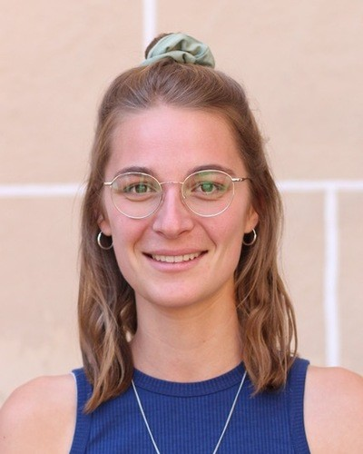
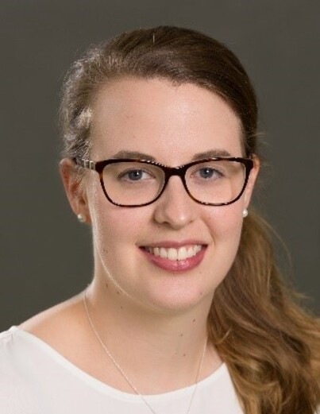

# Soapbox Science Tübingen

## Our mission

Soapbox Science is a novel public outreach platform for promoting women and
non-binary scientists and the science they do. Events transform public areas
into an arena for public learning and scientific debate; they follow the format
of London Hyde Park’s Speaker’s Corner, which is historically an arena for
public debate. With Soapbox Science, we want to make sure that everyone has the
opportunity to enjoy, learn from, heckle, question, probe, interact with and be
inspired by some of our leading scientists. No middle man, no PowerPoint slide,
no amphitheatre – just remarkable women and non-binary scientists who are there
to amaze you with their latest discoveries, and to answer the science questions
you have been burning to ask. Or simply hear them talk about what
fascinates them, and why they think they have the most fantastic job in the
world!

26 July 2025
{: style="color:#159957; font-size: 200%; font-weight: bold; text-align: center;"}
Tübingen town centre
{: style="color:#159957; font-size: 150%; font-weight: bold; text-align: center;"}

## Speakers 

 

  

   
    Alexandra Waldherr
  

  

   
    Ana Villar
  

  

   
    Annalena Kofler
  

  

   
    Dr Inf Dipl-Ing (FH) Bianca Weber-Lewerenz
  

   

  

  

   
    Carolina Guidolin
  

  

   
    Dr Christina Preiser
  

    

   
    Elise Bücklein
  

    

   
    Gesa Freimann
  

  

      
 

  

  
    Hanna Wierenga
  

  

   
    Dr Kristina Hopfensberger
  

  

 
    Dr Maydel Fernandez-Alonso
  

  

   
    Sisi Deng
  

 

 

## Organising team

 

  

   
   Ben Höltgen
  

  

   
   Dilsad Er
  

  

   
   Melanie Stelly
  

  

   
   Michela Petriconi
  

 

 

 
  Dr Monika Lam
 

  

  
  Ritu Roy Chowdhury
 

  

  
  Susan Fischer
 

## Speaker call - now closed

We are looking for active researchers from STEMM fields (Science, Technology,
Engineering, Mathematics, and Medicine), including PhD students, postdocs,
professors, and beyond, who:

- Are excited about communicating science in an accessible and engaging way.
- Are passionate about connecting with a diverse audience.
- Identify as a woman or non-binary person.

**When**: 26 July 2025

**Where**: Tübingen town centre

{:style="display:block; margin-left:auto; margin-right:auto"}

## Contact

[soapboxscience.tuebingen@gmail.com](mailto:soapboxscience.tuebingen@gmail.com)

 
 
 

